## "What is Free Software?" - GNU Project - Free Software Foundation
Vapaan ohjelmiston määritelmä: Ohjelmisto on vapaa, jos käyttäjillä on neljä perusvapautta:

Vapaus käyttää ohjelmaa mihin tahansa tarkoitukseen.
Vapaus tutkia ja muuttaa ohjelman toimintaa (edellyttää pääsyä lähdekoodiin).
Vapaus jakaa ohjelman kopioita.
Vapaus jakaa muokattuja versioita.

Keskeiset periaatteet:

Kyse on vapaudesta, ei hinnasta ("free as in free speech, not free beer").
Ei-avoimet ohjelmat (proprietary software) kontrolloivat käyttäjiä, mikä tekee niistä epäeettisiä.

Kaupallisuus ja jakaminen:

Vapaat ohjelmistot voivat olla kaupallisia.
Jakelussa voidaan käyttää esimerkiksi "copyleftia" varmistamaan vapauden säilyminen.

## Raportin kirjoittaminen.

Raportoinnin tavoitteet: Raportin tulee olla toistettava: sama ympäristö tuottaa saman tuloksen.
Ole täsmällinen: mainitse ympäristö, käytetyt komennot, ja tulokset (onnistumiset ja virheet).

Helppolukuisuus: Käytä väliotsikoita ja kirjoita huolellista kieltä.
Kirjoita menneessä aikamuodossa.

Lähteet ja viittaukset: Viittaukset osoittavat perehtyneisyyttä ja takaavat hyvän akateemisen käytännön.
Esimerkkejä: kirjalliset viitteet, suulliset tiedonannot ja verkkolinkit.

Vältettävät virheet: Sepittäminen (raportin keksiminen ilman oikeaa testausta).
Plagiointi (teksti tai kuvat ilman lähdemainintaa).

Käytännön vinkit: Kirjoita raportti suoraan sähköisessä muodossa, jotta työvaiheet ovat dokumentoituna reaaliajassa.
Tiivistelmä raportin alkuun auttaa lukijaa ymmärtämään työn tulokset nopeasti.

Muita huomioita: Vapaan ohjelmiston käsitettä sovelletaan myös muihin käytännön teoksiin, kuten oppimateriaaleihin.
"Avoin lähdekoodi" eroaa vapaista ohjelmistoista ideologisesti ja käytännöllisesti.

# Linuxin asennus

## Tarvittavat työkalut
Lataa Debian ISO:
Lataa debian-live-12.6.0-amd64-xfce.iso osoitteesta cdimage.debian.org.
Asenna VirtualBox:
Jos käytät Windowsia tai macOS:ää, lataa VirtualBox ja suorita asennus.

## Virtuaalikoneen luominen
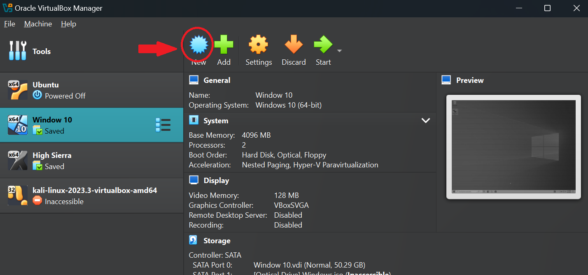
Avaa VirtualBox ja valitse Uusi kone. Käytä Asiantuntijatila:

Nimi: Debian
Tyyppi: Linux
Versio: Debian (64-bit)
Muisti: 4000 MB (tai enemmän)
Virtuaalilevy: Luo uusi levy, 60 GB (dynaaminen allokaatio).
Lisää ISO-tiedosto virtuaalikoneeseen:

Valitse virtuaalikoneen asetuksista Tallennus ja liitä ISO-tiedosto virtuaaliseen CD-ROM-asemaan.
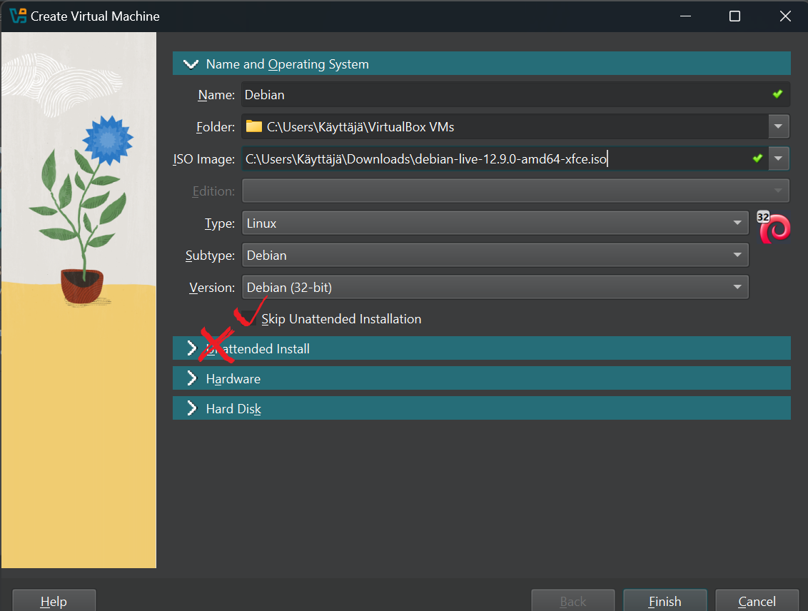 

## Asennusprosessi
Käynnistä virtuaalikone ja valitse Live Desktop.

Paina työpöydän alakulmassa olevaa Install Debian -painiketta.

Seuraa ohjattua asennusta:

Kieli: Valitse kieli.
Aikavyöhyke: Määritä sijaintisi.
Näppäimistö: Valitse näppäimistömalli.
Osiointi: Valitse Tyhjennä levy ja asenna Debian (virtuaalilevy tyhjennetään automaattisesti).
Käyttäjätiedot: Luo käyttäjänimi ja salasana.
Tarkista asetukset ja aloita asennus.
Odota asennuksen valmistumista (~10 minuuttia).

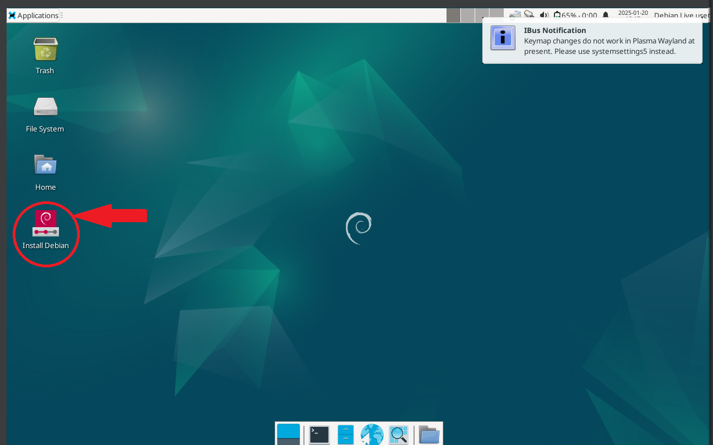 
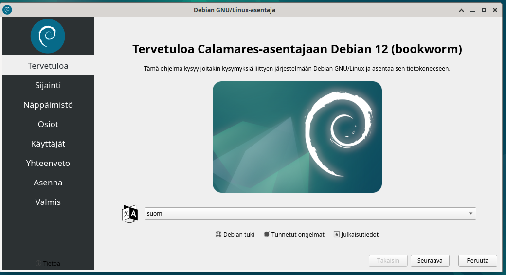
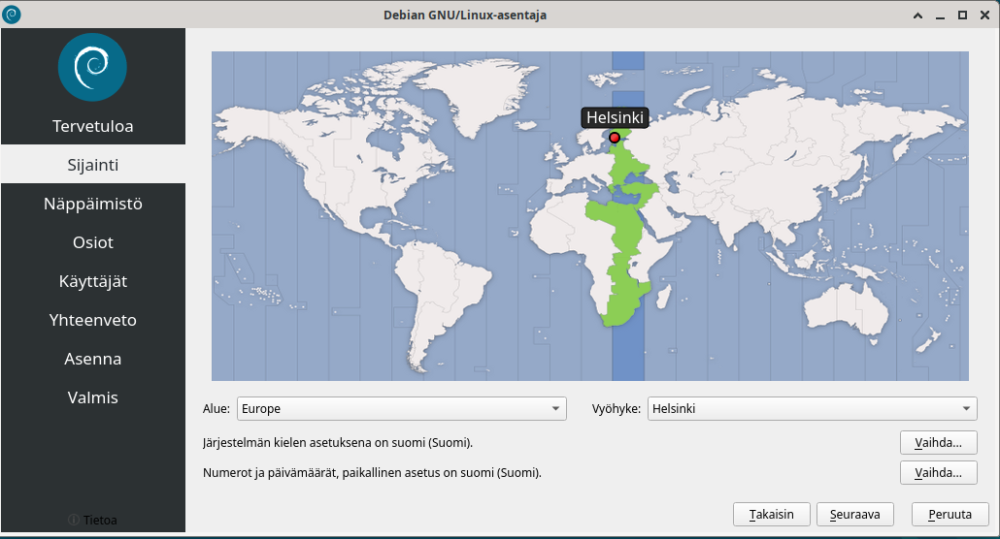 
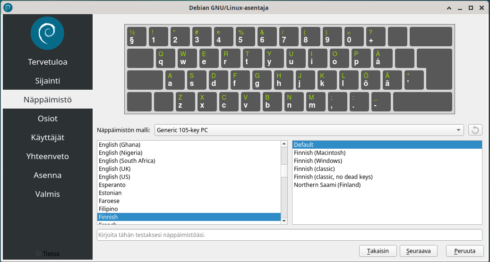 
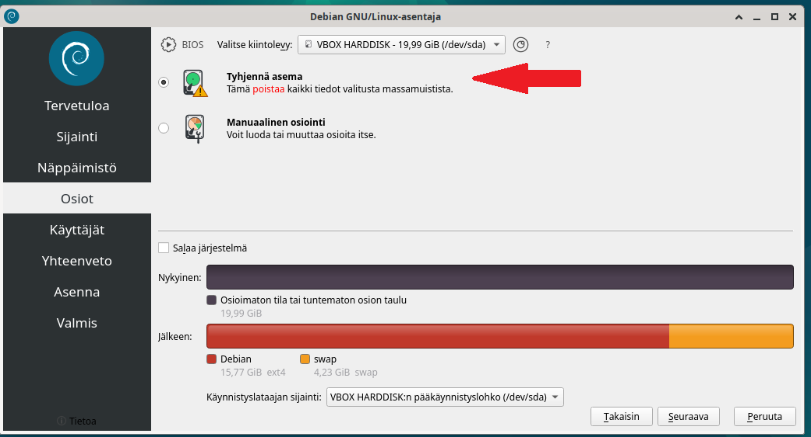
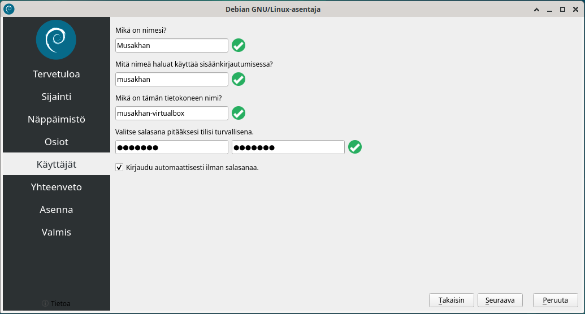 
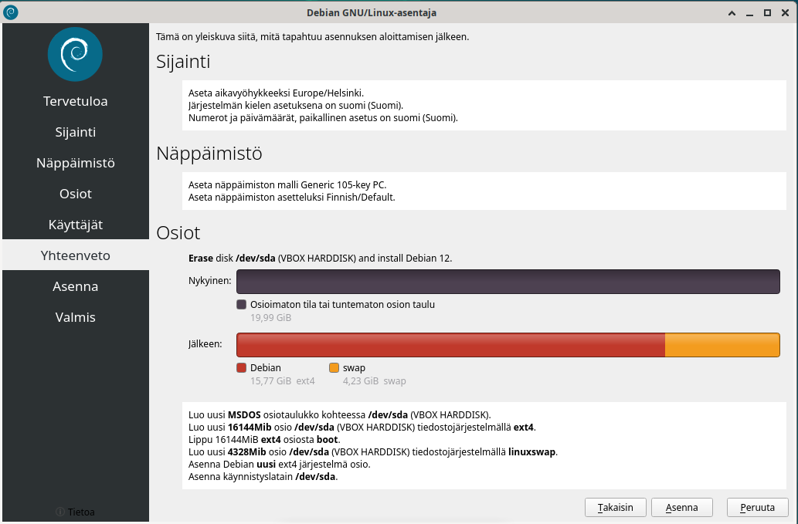 
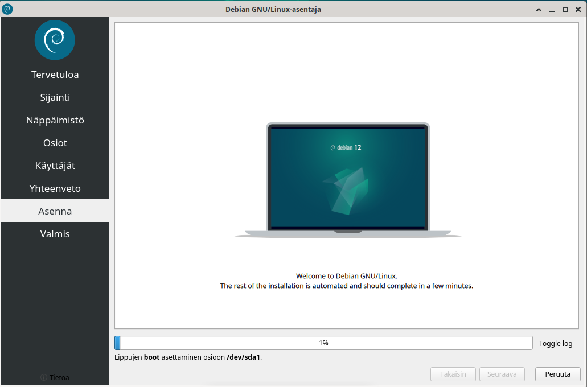 
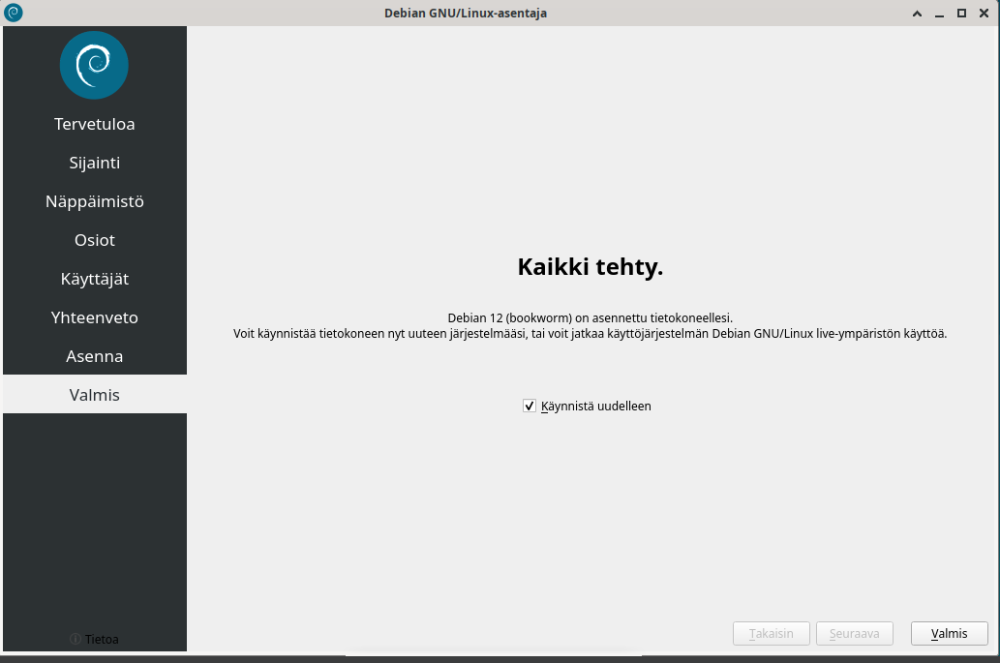 

## Lähteet
"Pohjana Tero Karvinen 2021: https://terokarvinen.com/2021/install-debian-on-virtualbox/"
